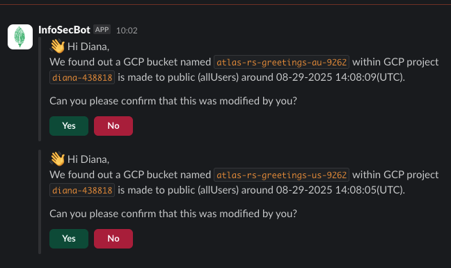

# atlas-rs
Deploys a 5-node globally distributed Replica Set in MongoDB Atlas (GCP) and a regional demo (GCS + Cloud Functions v2).


## Terraform Infrastructure

This repository now contains a Terraform project (in `terraform/`) that provisions:

* A MongoDB Atlas cluster in an existing Atlas Project
* A two-region (GCP Eastern US + Australia/Southeast) advanced replica set cluster (5 electable nodes by default: 3 in EASTERN_US, 2 in AUSTRALIA_SOUTHEAST) running MongoDB 7.0. Note: Multi-region requires at least M30 instance size.

### 1. Prerequisites

* Terraform >= 1.6
* MongoDB Atlas API Keys with access to the target project
* Existing Atlas Project ID (set `atlas_project_id`)
* `gcloud` CLI. [install link](https://cloud.google.com/sdk/docs/install)
* GCP service account credentials (JSON) for optional demo resources (storage + cloudfunctions)
* (Optional) Remote state: you can configure a backend later (S3, GCS, etc.). By default this project uses local state.

#### Atlas

The MongoDB Atlas provider requires credentials. Export the following environment variables before `terraform init/plan/apply`:

```bash
export MONGODB_ATLAS_PUBLIC_KEY=
export MONGODB_ATLAS_PRIVATE_KEY=
export TF_VAR_atlas_project_id=
```

#### GCP

You can create a dedicated Service Account or use your own login.

```bash
export TF_VAR_gcp_project_id=
gcloud auth application-default login
gcloud config set project $TF_VAR_gcp_project_id
gcloud services enable serviceusage.googleapis.com storage.googleapis.com run.googleapis.com cloudfunctions.googleapis.com cloudbuild.googleapis.com --project $TF_VAR_gcp_project_id
```

### 2. Deploy Resources

```bash
cd terraform
terraform init
terraform validate
terraform plan
terraform apply
```

For MongoDB Employees, acknowledge the InfoSec messages:


## Docker Tools Image (Atlas CLI + Terraform)

- Build a local image that includes Terraform, the MongoDB Atlas CLI, copies this repo’s `terraform/` folder, and pre-downloads required providers.

```bash
docker build -t atlas-tf-tools .
```

- Run it with your Atlas and GCP credentials (example):

```bash
docker run -it --rm \
  -e MONGODB_ATLAS_PUBLIC_KEY=$MONGODB_ATLAS_PUBLIC_KEY \
  -e MONGODB_ATLAS_PRIVATE_KEY=$MONGODB_ATLAS_PRIVATE_KEY \
  -e TF_VAR_atlas_project_id=$TF_VAR_atlas_project_id \
  -e TF_VAR_gcp_project_id=$TF_VAR_gcp_project_id \
  # Mount your GCP service account JSON to the path set in the image
  -v $(pwd)/gcp-sa.json:/creds/gcp.json:ro \
  atlas-tf-tools

# inside the container
terraform validate
terraform plan
terraform apply
```

Notes:
- Providers are pre-fetched during the image build (via `terraform init -backend=false`).
- The Atlas CLI (`atlas`) and Terraform (>= 1.6) are installed in the image.
- If you use a remote backend, configure credentials at runtime rather than during build. The container exposes `GOOGLE_APPLICATION_CREDENTIALS=/creds/gcp.json`; mount your SA JSON there.

## Backend (State)

- By default, Terraform uses local state in the `terraform/` directory. If you want remote state (e.g., GCS or S3), add a backend block in `terraform/versions.tf` and run `terraform init` to configure/migrate state.

### 3. Run Demos

> [!WARNING]
> **Open the `demo_site_urls` after each change in an Incognito Window to avoid a stale cached version!!**

#### Localized Reads vs not so

See the read-preference switch demo: `demos/read-preference-switch/README.md:1`

#### Upgrade to MongoDB 8.0 while application is running.

See the step-by-step Terraform demo: `demos/upgrade-mongodb-7-to-8/README.md:1`

#### Test Resilience in Atlas

- **Primary Failover**
  Note the primary still resides in US Central due to the priorities
- **Regional Outage**
  Australia: R/W still happen
  US: R only


#### Convert Replica Set to One-Shard Cluster

See the sharding upgrade demo: `demos/replicaset-to-one-shard/README.md:1`


#### Safe to ignore Error(s) during Demos

You can IGNORE the following:

```bash
Error: Provider produced inconsistent final plan
│
│ When expanding the plan for google_cloudfunctions2_function.api_au[0] to include new values learned so far during apply, provider "registry.terraform.io/hashicorp/google" produced an invalid new value for
│ .service_config[0].environment_variables: new element "READ_PREFERENCE" has appeared.
│
│ This is a bug in the provider, which should be reported in the provider's own issue tracker.
```

### 4. Tear it down

```bash
cd terraform
terraform destroy
```

---

### App Demo GCP / Cloud Functions v2

Deploy a simple static HTML demo (GCS website in each region) that:

* Polls for the latest greeting document: `db.test.test.find().sort({ timestamp: -1 }).limit(1)`
* Inserts a random greeting with "Record Greeting" button
* Lets user adjust polling interval (milliseconds; 20ms–10,000ms)
* Uses `readPreference: nearest` (driver) so each function read hits a local secondary when possible
