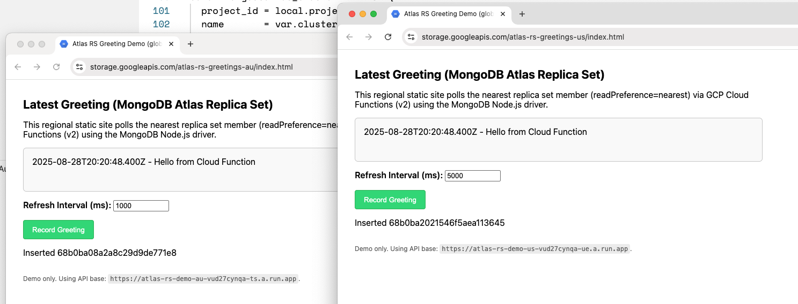

# atlas-rs
Deploys a 5-node globally distributed Replica Set in MongoDB Atlas (GCP) and a regional demo (GCS + Cloud Functions v2).



## Terraform Infrastructure

This repository now contains a Terraform project (in `terraform/`) that provisions:

* A MongoDB Atlas cluster in an existing Atlas Project
* A two-region (GCP Eastern US + Australia/Southeast) advanced replica set cluster (5 electable nodes by default: 3 in EASTERN_US, 2 in AUSTRALIA_SOUTHEAST) running MongoDB 7.0. Note: Multi-region requires at least M30 instance size.

### 1. Prerequisites

* Terraform >= 1.6
* MongoDB Atlas API Keys with access to the target project
* Existing Atlas Project ID (set `atlas_project_id`)
* `gcloud` CLI. [install link](https://cloud.google.com/sdk/docs/install)
* GCP service account credentials (JSON) for optional demo resources (storage + cloudfunctions)

#### Atlas

The MongoDB Atlas provider requires credentials. Export the following environment variables before `terraform init/plan/apply`:

```bash
export MONGODB_ATLAS_PUBLIC_KEY=
export MONGODB_ATLAS_PRIVATE_KEY=
export TF_VAR_atlas_project_id=
```

#### GCP

You can create a dedicated Service Account or use your own login.

```bash
export TF_VAR_gcp_project_id=
gcloud auth application-default login
gcloud config set project $TF_VAR_gcp_project_id
gcloud services enable storage.googleapis.com run.googleapis.com cloudfunctions.googleapis.com cloudbuild.googleapis.com
```

### 2. Deploy Resources

```bash
cd terraform
terraform init
terraform validate
terraform plan
terraform apply
```


### 3. Tear it down

```bash
cd terraform
terraform destroy
```

---

### App Demo GCP / Cloud Functions v2

Deploy a simple static HTML demo (GCS website in each region) that:

* Polls for the latest greeting document: `db.test.test.find().sort({ timestamp: -1 }).limit(1)`
* Inserts a random greeting with "Record Greeting" button
* Lets user adjust polling interval (milliseconds; 20ms–10,000ms)
* Uses `readPreference: nearest` (driver) so each function read hits a local secondary when possible
