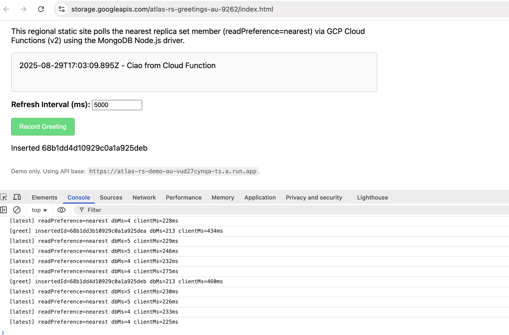

# Demo: Switch Read Preference (`nearest` → `primary` → `primaryPreferred`)

This demo shows how to change the application read preference for the sample Cloud Function API using Terraform.

Valid values: `primary`, `primaryPreferred`, `secondary`, `secondaryPreferred`, `nearest`.

## Notes

- The API includes a `readPreference` in its JSON response for `GET /latest` so you can confirm what the function is using.
- For global deployments, `nearest` typically yields regional reads from local secondaries; `primary` forces reads to the primary region; `primaryPreferred` prefers primary but falls back to secondaries when primary is unavailable.
- You can revert to the default at any time: `terraform apply  -var='demo_read_preference=nearest'`.



## Prerequisites

- Deploy the stack at least once (see root README)
- Ensure the demo API endpoints are output (`demo_api_urls`)

## Switch to `primary`

- Run:

  ```bash
  cd terraform
  terraform plan -var='demo_read_preference=primary'
  terraform apply -var='demo_read_preference=primary'
  ```

- Open both app instances andc conduct reads/writes.
- Open the Console (Inspect -> Console) to see the read prefernce and stats on execution / round trip times.
- You may also simulate a primary or region failover.


## Switch to `primaryPreferred`

- Run:

  ```bash
  cd terraform
  terraform plan -var='demo_read_preference=primaryPreferred'
  terraform apply -var='demo_read_preference=primaryPreferred'
  ```

- Open both app instances andc conduct reads/writes.
- Open the Console (Inspect -> Console) to see the read prefernce and stats on execution / round trip times.
- You may also simulate a primary or region failover.
