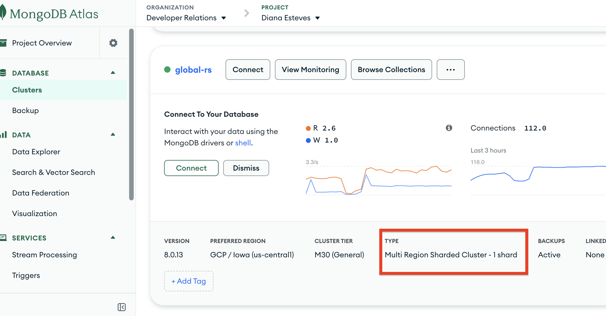

# Demo: Convert Advanced Replica Set → One‑Shard Sharded Cluster (Atlas)

This demo walks through converting the existing Advanced Cluster (Replica Set) to a Sharded Cluster with a single shard using Terraform. In Atlas, config servers are created and managed automatically as part of a sharded cluster — you do not provision them separately.

Important: This is a major topology change. Review in a non‑production environment first and ensure you have recent backups.

## What will change

- Cluster type: `REPLICASET` → `SHARDED`
- Atlas automatically provisions the Config Server replica set and `mongos` routing processes.

## Prerequisites

- Stack deployed at least once with the current replica set config
- Atlas API credentials exported (see root README)
- Cluster healthy; backups enabled recommended

## Update Terraform configuration

Edit `terraform/main.tf` in the [`mongodbatlas_advanced_cluster.global_rs`](../../terraform/main.tf#L17-L18) resource:

1) Change the cluster type to `SHARDED`

```hcl
resource "mongodbatlas_advanced_cluster" "global_rs" {
  # ...
- cluster_type        = "REPLICASET"
+ cluster_type        = "SHARDED"
  # ...
}
```

Notes
- Keep your existing `region_configs` so the single shard’s replica set remains distributed across your regions as before.
- Atlas manages Config Servers automatically; no extra Terraform blocks are required.

## Plan and apply

```bash
cd terraform
terraform plan
terraform apply
```

## Monitor progress

While the upgrade is taking place, monitor the application and conduct reads/writes as usual. You may also open up the Atlas console to view the upgrade taking place. Once the plan completes, refresh the Atlas UI.

- Atlas UI → Cluster → Activity Feed and Metrics
- Expect rolling changes as Atlas adds the config server RS and routing tier. Application connections may recycle during the transition.

Terraform will show changes converting the cluster to `SHARDED`. This is a lenghty-operation as new servers and network configurations take place behind the scenes. You will likely not be able to show this to completion so below is a screenshot when complete. Indicate the application still works and requires **no** restart or rededployment.



## Validate after conversion

- Check cluster type in Atlas UI: should show Sharded Cluster (1 shard)
- Connection string remains SRV; application should continue to work without code changes
- Optional quick checks:

