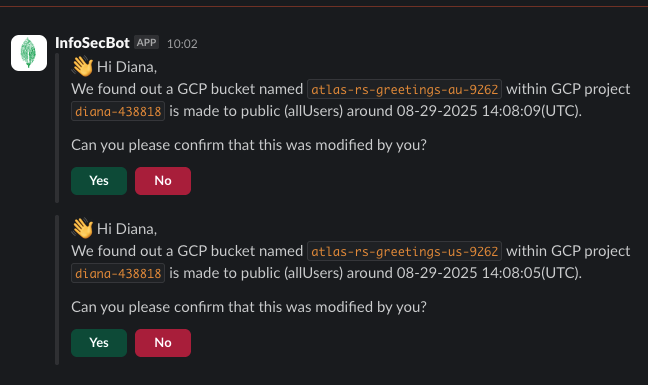

# Demo: Upgrade MongoDB Atlas from 7.0 to 8.0 (Terraform)

This demo shows how to perform a major version upgrade of the Atlas cluster managed by this repo from MongoDB 7.0 to 8.0 using Terraform.

The cluster version is controlled by the Terraform variable `mongo_db_major_version` defined in `terraform/variables.tf` and used by the `mongodbatlas_advanced_cluster` resource.

## Update the `variables.tf` file

Change the line [default     = "7.0"](../../terraform/variables.tf#L36-L37) to read `8.0`.

```bash
terraform plan
terraform apply -auto-approve
```

While the upgrade is taking place, monitor the application and conduct reads/writes as usual. You may also open up the Atlas console to view the upgrade taking place. Once the plan completes, refresh the Atlas UI.



## What Terraform Changes

- Updates the Atlas cluster configuration to target MongoDB 8.0
- Atlas performs a rolling major version upgrade across replica set nodes
- Application endpoints (e.g., Cloud Functions) keep the same connection string; connections recycle as nodes roll

## Monitor Progress

- Atlas UI -> Cluster -> Activity Feed and Measurements
- Expect rolling restarts; reads/writes remain available with brief connection churn
